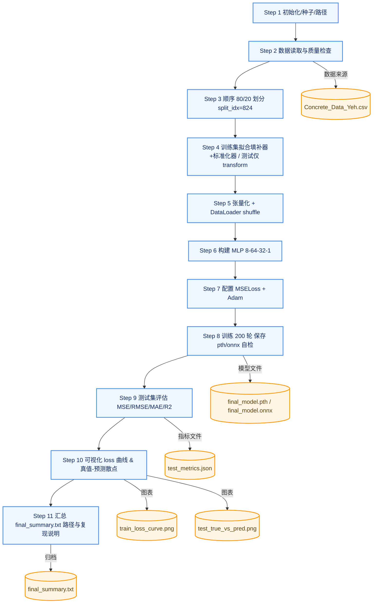

# Homework1 Report

> **Author**: 朱希涵  
> **StudentID**: SA25219006  
> **Date**: March, 2026  
> **GPU**: NVIDIA Tesla V100-SXM2-16GB

## 1. 摘要

本实验面向混凝土抗压强度预测任务，使用 1030 条样本、8 个输入特征构建回归模型。实验严格遵循题面约束：按原始顺序前 80% 作为训练集、后 20% 作为测试集，且预处理仅在训练集拟合后迁移到测试集，避免数据泄露。模型采用两层隐藏层的 MLP（64/32）并使用 Adam + MSELoss 训练 200 轮。最终在测试集得到 MSE=155.7277、RMSE=12.4791、MAE=10.0774、R^2=-0.0203，并输出训练损失曲线、真实值-预测值散点图及 ONNX 模型与结构可视化文件。

## 2. 任务定义与约束

### 2.1 任务定义

- 输入特征：cement, slag, flyash, water, superplasticizer, coarseaggregate, fineaggregate, age
- 输出目标：csMPa（混凝土抗压强度）
- 任务类型：监督学习回归

### 2.2 题面硬约束

- 数据划分：前 80% 训练，后 20% 测试，禁止打乱。
- 预处理防泄露：缺失值填补和标准化均只在训练集 fit，测试集仅 transform。
- 主线优先：先完成 Step 1~Step 11 基础流程，不执行 Optional optimization methods。
- 必需产物：测试集 MSE、训练损失曲线、真实值-预测值散点图。

## 3. 数据集与基础检查

### 3.1 数据基本信息

- 数据文件：Concrete_Data_Yeh.csv
- 样本数：1030
- 列数：9（8 输入 + 1 输出）

### 3.2 字段与类型检查

- 列名顺序与题面一致：通过
- Data shape： (1030, 9)
- 数据类型：8 列为 float64，age 为 int64，目标为 float64

### 3.3 缺失值与异常值初筛（Step 2 日志）

- 缺失值计数：全部为 0
- 负值计数：全部为 0
- IQR 离群点计数：

| 字段 | IQR 离群点个数 |
| --- | ---: |
| cement | 0 |
| slag | 2 |
| flyash | 0 |
| water | 9 |
| superplasticizer | 10 |
| coarseaggregate | 0 |
| fineaggregate | 5 |
| age | 59 |
| csMPa | 4 |

结论：数据无缺失、无负值，存在一定离群样本（尤其 age），本次基线未进行额外离群点处理。

## 4. 方法与实现流程（Step 1~Step 11）



### 4.1 分步执行结果摘要

| Step | 关键动作 | 结果 |
| --- | --- | --- |
| 1 | 初始化、固定随机种子、路径检查 | 通过 |
| 2 | 读数与数据质量检查 | 通过 |
| 3 | 按索引顺序 80/20 切分 | 通过（split_idx=824） |
| 4 | 训练集拟合填补器+标准化器，测试集仅变换 | 通过 |
| 5 | 张量化与 DataLoader 测试 | 通过 |
| 6 | 构建 MLP 并前向 shape 检查 | 通过（输出 (batch,1)） |
| 7 | 配置 MSELoss 与 Adam，单 epoch 更新 | 通过 |
| 8 | 完整训练并保存 pth/onnx 与 loss 序列 | 通过 |
| 9 | 测试评估（MSE/RMSE/MAE/R^2） | 通过 |
| 10 | 生成两张基础图 | 通过 |
| 11 | 汇总结果与可复现信息 | 通过 |

## 5. 模型结构与训练配置

### 5.1 模型结构

- 模型类型：MLP 回归
- 结构：8 -> 64 -> 32 -> 1
- 激活函数：ReLU（隐藏层）
- 输出层：线性输出（无激活）

### 5.2 训练配置

- 损失函数：MSELoss
- 优化器：Adam
- 学习率：0.001
- 批大小：32
- 训练轮数：200
- 随机种子：42
- 设备：CUDA（可用时）

## 6. 实验结果与分析

### 6.1 指标结果

| 指标 | 数值 |
| --- | ---: |
| MSE | 155.7277 |
| RMSE | 12.4791 |
| MAE | 10.0774 |
| R^2 | -0.0203 |

结果解读：

- MSE/RMSE/MAE 显示模型已学习到部分映射关系，但测试误差仍偏高。
- R^2 为负，表明当前基线模型在测试集上的泛化能力弱于“预测均值”基线，存在明显改进空间。

### 6.2 训练损失曲线


现象：训练损失从约 1617 快速下降到约 18.87，并在后期趋于平稳。
解释：优化过程收敛正常，模型在训练集上拟合能力较强。
结论：训练阶段无明显数值不稳定问题，但训练损失持续下降不等价于测试泛化提升。

### 6.3 真实值-预测值散点图


现象：散点总体与对角线同向，但离散程度较高；高强度区间与低强度区间均存在偏差。
解释：模型捕捉了部分趋势，但未充分学习所有工况下的强度变化规律。
结论：当前基线可作为后续优化起点，不宜作为最终最优模型。

## 7. ONNX 导出与可视化分析

### 7.1 ONNX 导出

- 已在主程序训练流程中导出 ONNX：final_model.onnx。
- 导出目的：便于跨框架推理部署与结构可视化验证。

### 7.2 Netron 可视化结果


### 7.3 结构一致性说明

- ONNX 网络拓扑与 PyTorch 中的 MLP 结构一致：输入 8 维，经过两层全连接 + ReLU，输出 1 维。
- 从可视化结果可确认导出的静态图结构完整，满足报告展示与后续部署检查需求。
- 代码中包含 ONNX 导出后的自检逻辑（PyTorch 输出与 ONNXRuntime 输出比对），用于验证数值一致性。

## 8. 可复现性说明

### 8.1 环境与命令

- Python 环境：项目本地 conda 环境 .conda/nn_hw
- 一键执行主线命令：

```bash
.conda/nn_hw/python.exe NN_Homework/Homework1/project/train.py --step 11
```

### 8.2 关键输入与输出

- 输入数据：NN_Homework/Homework1/resource/Concrete_Data_Yeh.csv
- 关键输出：
  - NN_Homework/Homework1/project/outputs/final_model.pth
  - NN_Homework/Homework1/project/outputs/final_model.onnx
  - NN_Homework/Homework1/project/outputs/test_metrics.json
  - NN_Homework/Homework1/project/outputs/train_loss_history.json
  - NN_Homework/Homework1/project/outputs/train_loss_curve.png
  - NN_Homework/Homework1/project/outputs/test_true_vs_pred.png
  - NN_Homework/Homework1/project/outputs/final_model.onnx.png
  - NN_Homework/Homework1/project/outputs/final_model.onnx.svg
  - NN_Homework/Homework1/project/outputs/final_summary.txt

### 8.3 证据链对应关系

- 指标结论 -> test_metrics.json
- 训练收敛结论 -> train_loss_history.json + train_loss_curve.png
- 泛化表现结论 -> test_true_vs_pred.png
- 模型结构一致性结论 -> final_model.onnx + final_model.onnx.png/svg

## 9. 局限性与后续方向

- 当前报告为基础主线结果，未执行扩展实验。
- 局限性：
  - 测试集 R^2 为负，表明基线泛化能力有限。
  - 未引入领域特征工程（如水灰比）与更系统调参。
- 后续方向（仅建议，不在本报告执行）：
  - 引入验证集与早停策略；
  - 进行学习率调度与超参数搜索；
  - 对比树模型基线（如随机森林、XGBoost）；
  - 在保持题面主线结果不变的前提下开展扩展实验章节。

## 10. 结论

本次实验已完整完成 Step 1~Step 11 基础主线，严格遵守了顺序 80/20 切分和防数据泄露规则，并产出了指标、图表、模型文件与可复现说明。基线 MLP 在训练集上收敛良好，但测试泛化仍有改进空间。当前结果可作为作业基础提交版本，并为后续优化实验提供明确起点。

