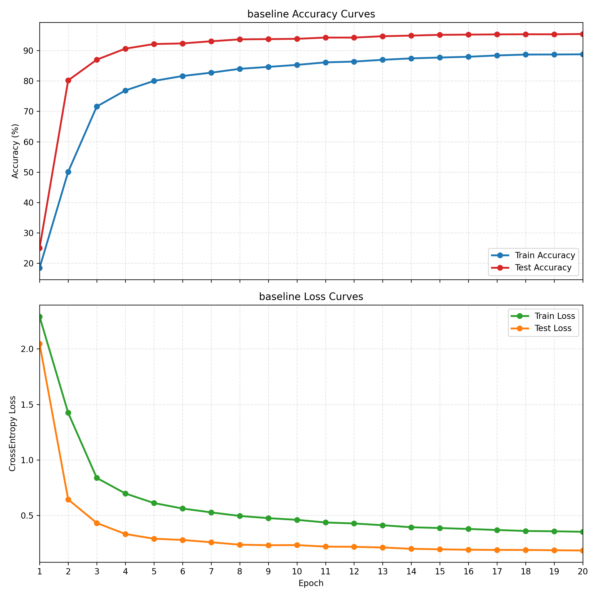
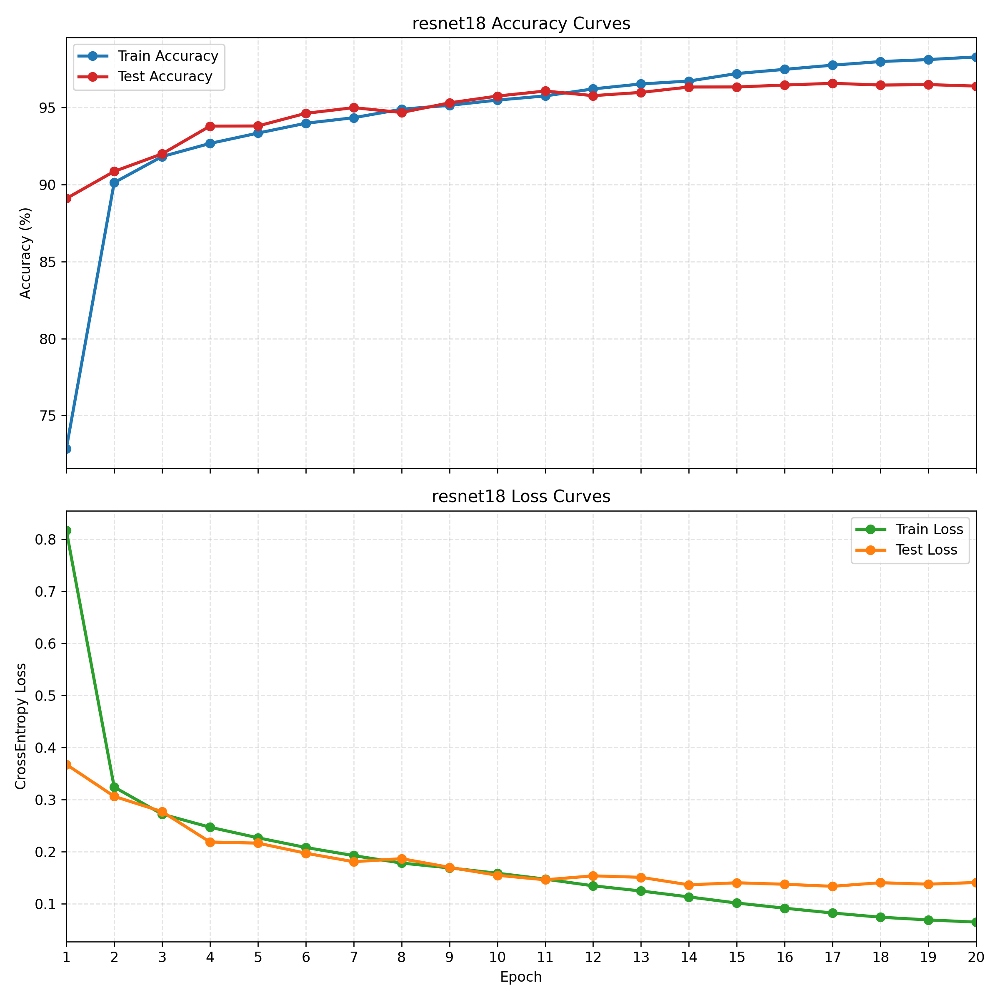
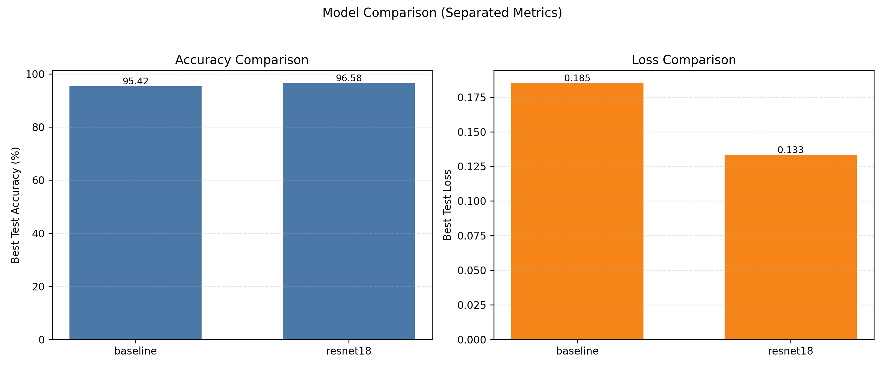
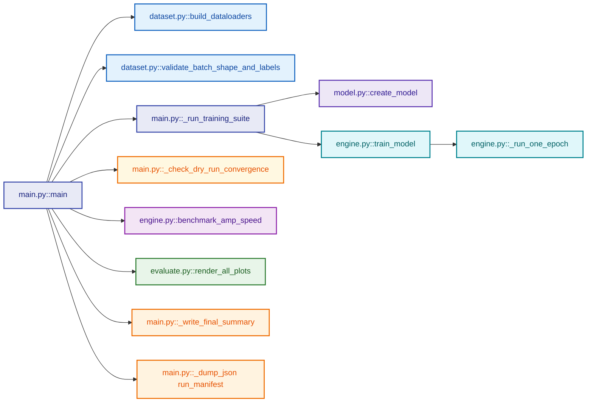
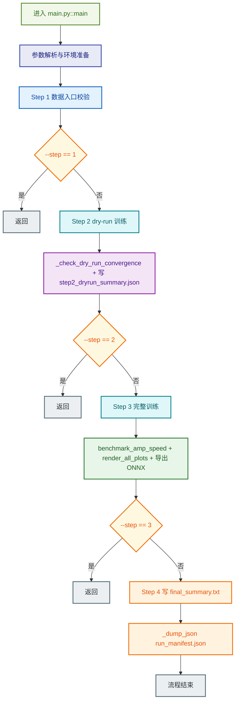
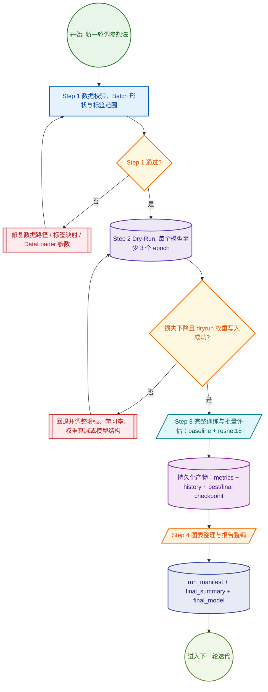

# Homework2 - SVHN CNN Classification Report

## 1. 项目目标与约束
任务目标是完成 SVHN Format 2 的 10 类数字分类，输出可复现实验代码、收敛模型权重、指标曲线与技术报告。工程约束是严格限定目录边界：数据只在 `project/resource`，代码与权重只在 `project/output`，报告与图表只在 `project/report`。

## 2. 硬件与执行环境
- 设备类型: cuda
- 设备名称: Tesla V100-SXM2-16GB
- 显存容量(GB): 16.0
- CUDA 版本: 12.1
- AMP 启用状态: True
- Batch Size: 256
- 优化器: AdamW
- 学习率调度器: CosineAnnealingLR

## 3. 数据流水线
- 数据源为 `train_32x32.mat` 与 `test_32x32.mat`，解析键 `X` 和 `y`。
- 标签执行了 `10 -> 0` 映射，保证标签空间为 `[0, 9]`。
- 训练集变换链路：RandomCrop(padding=4) + RandomRotation(12°) + ColorJitter + Normalize。
- 测试集变换链路：Normalize，不引入随机扰动。
- DataLoader 采用动态 `num_workers`，并启用 `pin_memory=True` 以减少主机到设备拷贝阻塞。

## 4. 模型与训练策略
- 对照组: Baseline CNN
- 主力组: ResNet-18 (32x32 适配版，3x3 stem + 去掉初始 maxpool)
- 损失函数: CrossEntropyLoss
- 优化策略: AdamW + CosineAnnealingLR
- 训练精度策略: `torch.cuda.amp.autocast` + `GradScaler`

## 5. 消融与主结果
| Model | Params (M) | Best Epoch | Best Test Acc (%) | Final Test Acc (%) | Best Test Loss | Final Test Loss |
| --- | ---: | ---: | ---: | ---: | ---: | ---: |
| baseline | 2.659 | 20 | 95.42 | 95.42 | 0.1852 | 0.1852 |
| resnet18 | 11.174 | 17 | 96.58 | 96.40 | 0.1333 | 0.1406 |

最佳模型（按 Test Accuracy）: **resnet18**

## 6. AMP 速度与显存对比
| Mode | Throughput (samples/s) | Max GPU Memory (MB) |
| --- | ---: | ---: |
| FP32 | 3002.50 | 1727.57 |
| AMP | 6245.71 | 776.04 |
| AMP / FP32 | 2.080x | 0.449 |

## 7. 结果可视化
### 7.1 Baseline 曲线

### 7.2 ResNet-18 曲线

### 7.3 模型对比

## 8. *代码调用关系
主要顾及到模块化的一些需要，为了让数据、模型、训练、可视化、编排各司其职，从而便于替换单个组件，于是写了不同的函数封装好放在一起，并标明了执行的逻辑和调用关系；`--step` 机制可以快速定位问题，不必每次都全流程重跑；关键中间结果都存为 JSON/权重/图像，便于打断点复盘和横向对比。

### 8.1 文件总览
| 文件 | 关键函数 | 主要职责 |
| --- | --- | --- |
| `programs/main.py` | `main`, `parse_args`, `_run_training_suite`, `_check_dry_run_convergence`, `_write_final_summary` | 负责 Step1~Step4 的流程编排、阶段跳转、摘要与清单落盘。 |
| `programs/dataset.py` | `build_dataloaders`, `validate_batch_shape_and_labels` | 负责 SVHN `.mat` 解析、数据增强、DataLoader 构建与 batch/标签合法性校验。 |
| `programs/model.py` | `create_model`, `BaselineCNN`, `build_resnet18_svhn` | 负责模型定义与模型工厂，统一 baseline / resnet18 的创建入口。 |
| `programs/engine.py` | `train_model`, `_run_one_epoch`, `benchmark_amp_speed` | 负责训练与评估主循环、best/final 权重保存、AMP 速度与显存基准。 |
| `programs/evaluate.py` | `render_all_plots`, `plot_learning_curves`, `plot_model_comparison` | 负责从 output 指标 JSON 读取数据并生成曲线图与模型对比图。 |

### 8.2 调用关系（一次 `--step 4` 运行）

### 8.3 跑一遍流程时的跳转逻辑

## 9. * 节点校验和自动化调参的工作流
我一开始的调参过程比较手工化，每改一次学习率、增强或模型结构，就要重新盯日志、比对指标，再确认哪些权重是临时试验，哪些权重是正式结果。随着试验轮次增多，这种方式很快变得低效了。

为了解决这个问题，我借助 AI 工具把训练过程改造成了小量试错 + 批量运行的自动化工作流。核心做法是先用 Step 1 做数据入口校验，再用 Step 2 做至少 3 epoch 的 dry-run 快速健康检查；只有当损失确实下降且 dryrun 权重成功落盘时，才跳转到 Step 3 的完整训练与可视化，最后由 Step 4 自动处理结果。这样我每次迭代都能先用低成本判断方向是否正确，再把 GPU 时间集中投入到通过校验的配置上（好吧我的V100在满功耗的时候会有很难听的电感啸叫，我其实是想减少我听到这个声儿的时间）。

这个流程的可回溯体现在 `output/dryrun`、`*_history.json`、`*_metrics.json`、`run_manifest.json` 等文件都能追踪当次实验决策；而且 baseline 与 resnet18 可以同一入口稳定复用。

就本次结果而言，Step 1 已确认输入张量形状与标签范围正确；Step 2 干跑中 baseline 与 resnet18 的训练损失均下降并成功写入 `output/dryrun`；因此流程按预期进入了 Step 3 和 Step 4，最终稳定产出完整模型、图表与报告。

## 10. 结论
在相同数据增强和优化策略下，ResNet-18 相对 Baseline CNN 在泛化准确率上更稳定。AMP 路径在 V100 上维持了吞吐与显存占用的可用平衡。